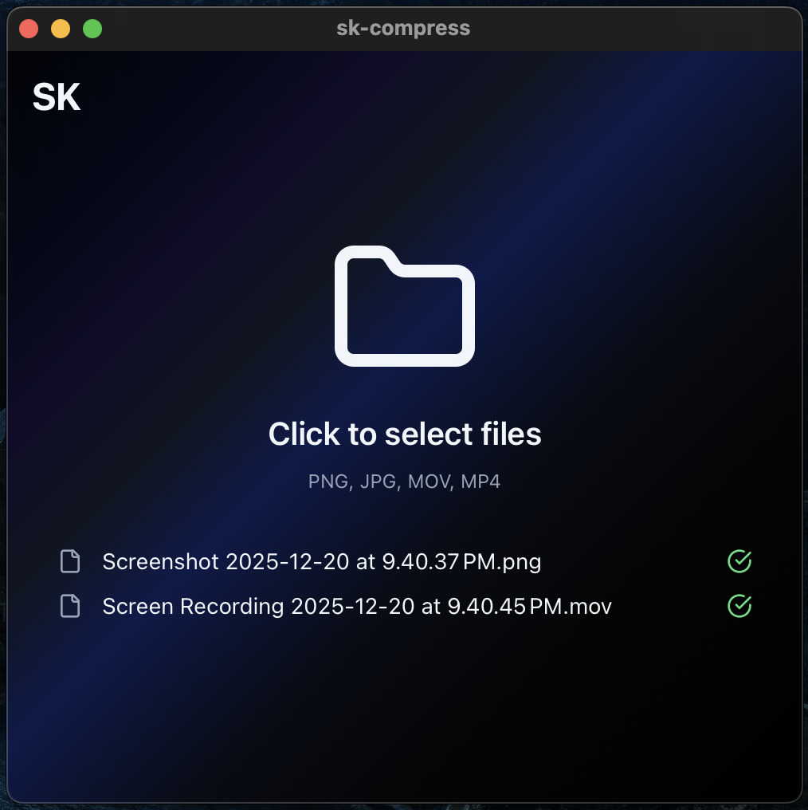

# sk-compress

A dead simple native media compressor app




## Features

- 🖼️ **Image Compression**: Convert PNG/JPG to compressed JPG (configurable quality 1-8)
- 📹 **Video Compression**: Convert MOV/MP4 to compressed MP4 (H.264, configurable CRF 18-28)
- 🎵 **Audio Compression**: Convert WAV/MP3/AAC/FLAC/M4A/OGG/WMA to MP3 (configurable bitrate 128-320 kbps)
- ⚙️ **Configurable Settings**: Adjustable quality, CRF, and bitrate via settings drawer
- 📦 **Bundled FFmpeg**: FFmpeg is bundled with the app - no external dependencies

## Tech Stack

- **Frontend**: React + TypeScript + Vite
- **Styling**: Tailwind CSS
- **Backend**: Rust (Tauri) calling FFmpeg directly
- **Desktop**: Tauri v2
- **Code Quality**: ESLint + Prettier

## Prerequisites

- [Node.js](https://nodejs.org/) 18+
- [Rust](https://www.rust-lang.org/tools/install) (for Tauri)
- [npm](https://www.npmjs.com/)

## Setup

1. Clone the repository
2. Install dependencies:

```bash
npm install
```

3. Download FFmpeg binary for your platform and place it in `src-tauri/binaries/`:

**macOS (Apple Silicon):**

```bash
# Download from https://evermeet.cx/ffmpeg/ or use Homebrew
cp $(which ffmpeg) src-tauri/binaries/ffmpeg-aarch64-apple-darwin
```

**macOS (Intel):**

```bash
cp $(which ffmpeg) src-tauri/binaries/ffmpeg-x86_64-apple-darwin
```

**Windows:**

```bash
# Download from https://www.gyan.dev/ffmpeg/builds/
# Place ffmpeg.exe as src-tauri/binaries/ffmpeg-x86_64-pc-windows-msvc.exe
```

**Linux:**

```bash
cp $(which ffmpeg) src-tauri/binaries/ffmpeg-x86_64-unknown-linux-gnu
```

> In development mode, if no bundled binary is found, the app falls back to system ffmpeg.

## Development

Run the development server:

```bash
npm run tauri:dev
```

This will:

- Start the Vite dev server on `http://localhost:5173`
- Launch the Tauri window
- Enable hot reload

## Building

Build for production:

```bash
npm run tauri:build
```

Outputs will be in `src-tauri/target/release/bundle/`:

- **macOS**: `.app` bundle and `.dmg` installer
- **Windows**: `.exe` installer
- **Linux**: `.AppImage` or `.deb`

## Usage

1. Launch the application
2. Click anywhere to select media files (PNG, JPG, MOV, MP4, WAV, MP3, AAC, FLAC, M4A, OGG, WMA)
3. Files will automatically be compressed
4. Adjust compression settings via the settings icon in the top-right corner
5. Output files appear in the same directory as the source

## File Conversion

- **PNG/JPG → JPG**: Compressed with configurable quality (default: 6, range: 1-8)
- **MOV/MP4 → MP4**: H.264 codec with configurable CRF (default: 22, range: 18-28), medium preset
- **WAV/MP3/AAC/FLAC/M4A/OGG/WMA → MP3**: Compressed with configurable bitrate (default: 320 kbps, options: 128, 192, 256, 320 kbps)

All settings are adjustable via the settings drawer (top-right icon). Output files are saved in the same directory as the source with `-compressed` suffix.

## Project Structure

```
sk-compress/
├── src/                 # React frontend
│   ├── components/      # React components
│   ├── lib/             # Utilities
│   └── utils/           # File utilities
├── src-tauri/           # Tauri/Rust backend
│   ├── binaries/        # FFmpeg binaries (per platform)
│   └── src/             # Rust source
└── docs/                # Documentation
```
