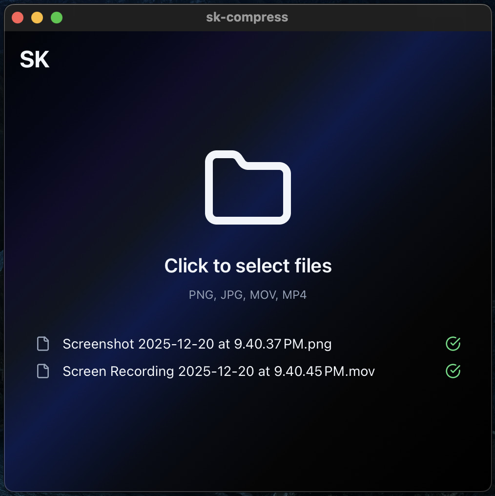

# kompress

A simple desktop app for compressing images, video, and audio files.




## Features

- Drag-and-drop or click-to-browse workflow
- Compress **images** (`png`, `jpg`, `jpeg`, `heic`, `webp`) to JPG
- Compress **video** (`mov`, `mp4`, `mkv`) to MP4 / H.264
- Compress **audio** (`wav`, `mp3`, `aac`, `flac`, `m4a`, `ogg`, `wma`) to MP3
- Adjustable image quality, video CRF, and audio bitrate
- Built-in console drawer for progress and debug logs
- Bundled FFmpeg for packaged builds

## Quick Start

### Download

Download the latest release from [GitHub Releases](https://github.com/innernette-co/kompress/releases).

### Use

1. Launch the app
2. Adjust compression settings if needed
3. Drag files into the window or click to browse
4. Find output files next to the originals with a `-compressed` suffix

Settings persist between sessions automatically.

## Build Support

kompress supports **macOS** and **Linux** builds.

- **macOS** is the release path: signed, notarized, published builds
- **Linux** is supported for local development and unsigned local builds
- There is **no CI**; checks and releases run locally

## From Source

### Prerequisites

- [Node.js](https://nodejs.org/) `v22.22.1+`
- [Rust](https://www.rust-lang.org/tools/install)
- Platform-native build dependencies:
  - **macOS**: [Xcode Command Line Tools](https://developer.apple.com/xcode/) (`xcode-select --install`)
  - **Linux**: the system packages Tauri/WebKitGTK needs for your distro

### Setup

```bash
git clone https://github.com/innernette-co/kompress.git
cd kompress
npm install
```

Place a target-specific FFmpeg binary in `src-tauri/binaries/` before packaged builds:

```bash
# macOS (Apple Silicon)
cp $(which ffmpeg) src-tauri/binaries/ffmpeg-aarch64-apple-darwin

# macOS (Intel)
cp $(which ffmpeg) src-tauri/binaries/ffmpeg-x86_64-apple-darwin

# Linux
cp $(which ffmpeg) src-tauri/binaries/ffmpeg-x86_64-unknown-linux-gnu
```

In development mode, if no bundled binary is found, the app falls back to system ffmpeg at runtime.

## Development

```bash
npm run tauri:dev   # run the desktop app in dev mode
npx tauri build     # local production build
npm run lint        # eslint
npm run test:run    # vitest
npm run verify      # fixture-based ffmpeg verification
```

Build outputs land in `src-tauri/target/release/bundle/`:

- **macOS**: `.app` bundle and `.dmg`
- **Linux**: `.AppImage`, `.deb`, or `.rpm` depending on host tooling

## Documentation

- [Contributing Guide](./CONTRIBUTING.md)
- [Security Policy](./SECURITY.md)
- [Third-Party Notices](./NOTICE.md)

For maintainers: releases are cut on macOS via `npm run release:patch|minor|major`. See [CONTRIBUTING.md](./CONTRIBUTING.md) and the release section below for workflow details.

## Releasing

`src-tauri/tauri.conf.json` is the single source of truth for the app version; the release flow syncs it into `package.json` and `package-lock.json` automatically.

This repo follows [GitHub Flow](https://docs.github.com/en/get-started/using-github/github-flow): one long-lived `main` branch with short-lived feature branches. Releases tag `main` directly — there's no separate "release" or "develop" branch.

**Cut a release** — one command, no prompts:

```bash
npm run release:patch    # 1.1.2 → 1.1.3
npm run release:minor    # 1.1.2 → 1.2.0
npm run release:major    # 1.1.2 → 2.0.0
```

The script bumps the version in `tauri.conf.json`, syncs package files, promotes `[Unreleased]` in `CHANGELOG.md`, builds `aarch64-apple-darwin`, signs and notarizes the app, tags `v{version}`, pushes `main` and the tag to `origin`, and creates the GitHub release.

**Dry-run**:

```bash
bash bin/cut-release.sh minor --local --yes
```

If the version is already bumped, `npm run release` (publish) or `npm run release:local` (dry-run) skips the bump step and runs the rest.

## Auto-updater

kompress checks for updates on launch and shows an _Update to v…_ button in the
header when one is available. Tauri's Updater plugin fetches a manifest, then
verifies the downloaded payload against a **minisign public key compiled into
the app** before replacing it in place. Apple notarization and minisign are two
independent things: notarization is what stops Gatekeeper warnings, minisign is
what lets an installed copy trust an update.

### Signing key

|             |                                                                   |
| ----------- | ----------------------------------------------------------------- |
| Private key | `~/.tauri/kompress-updater-v2.key`                                |
| Public key  | pinned as `plugins.updater.pubkey` in `src-tauri/tauri.conf.json` |
| Key ID      | `F9792ECAA7E01400`                                                |
| Passphrase  | **none** — see below                                              |

The key is deliberately generated without a passphrase. The private key file is
the only secret, protected by filesystem permissions.

> **Back this file up.** It is not in the repo and cannot be regenerated. Losing
> it means every existing install permanently stops receiving updates — see
> _Key rotation_ below.

### Cutting a release with updater artifacts

Both variables must be exported, and the private key is passed by **contents**,
not by path:

```bash
export TAURI_SIGNING_PRIVATE_KEY="$(cat ~/.tauri/kompress-updater-v2.key)"
export TAURI_SIGNING_PRIVATE_KEY_PASSWORD=''   # empty string, not unset
npm run release:patch
```

Look for this line in the output:

```
✓ Updater artifacts present (tar + sig + latest.json)
```

If `TAURI_SIGNING_PRIVATE_KEY` is unset the release **still succeeds** — it
prints a warning, skips the updater artifacts, and publishes a DMG-only
release. That is a trap: `releases/latest/download/latest.json` then resolves to
a release with no manifest, and every installed copy silently stops finding
updates. Treat a missing `✓ Updater artifacts present` line as a failed release.

### Key rotation

Rotating the signing key strands every existing install. Installed apps have the
old public key compiled in and reject anything signed with a new one; no
subsequent release can reach them, because the updater is itself the delivery
mechanism. Affected users must re-download manually, and get no in-app signal
that anything is wrong.

This has happened once: the original key (`1A94B578A21899F6`) was generated
2026-06-08 with a passphrase that was later lost, and was replaced ahead of
v1.3.2. **Installs on v1.3.0 and v1.3.1 are permanently stranded.** The old key
file is retained at `~/.tauri/kompress-updater.key` in case the passphrase ever
surfaces — it could still sign one bridge release those installs would accept.

If rotation is ever unavoidable again, ship a visible notice alongside it.

### Testing the update path

Producing a valid signature does not prove an installed client accepts it. To
test end to end, install the _previous_ release from its DMG, then publish the
next one and confirm the update button appears, downloads, verifies, and
relaunches on the new version. Both releases must be signed with the same key —
across a rotation the old install cannot be updated at all, by design.

### Endpoints

`plugins.updater.endpoints` lists the canonical `innernette-co` URL first and
the legacy `samkasman` URL second; Tauri tries them in order. The legacy entry
exists because releases up to v1.3.2 have that slug compiled in and reach it
through GitHub's transfer redirect. **Never create a repository at
`samkasman/kompress`** — it would shadow that redirect and break update checks
for those installs.

## License

kompress is released under the MIT License — see [LICENSE](LICENSE) for the full text.

The app bundles FFmpeg (LGPL v2.1+) and other third-party software with their own licenses. See [NOTICE.md](NOTICE.md) for attribution and redistribution details.
